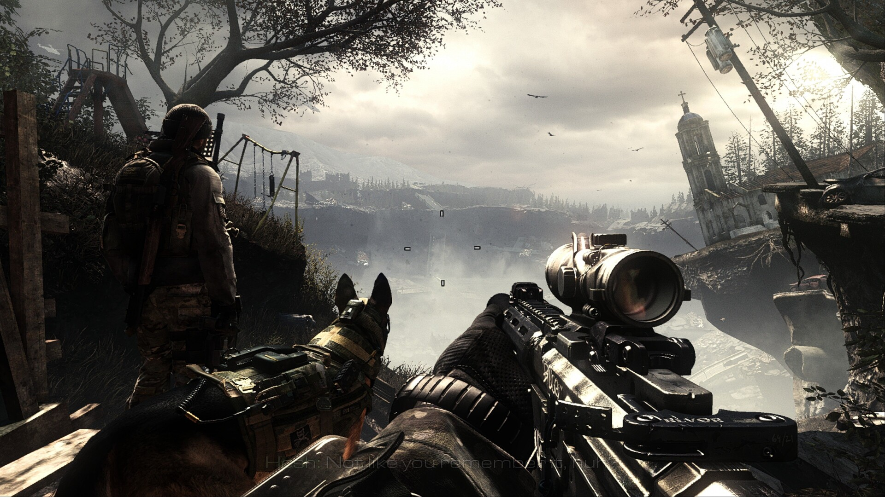
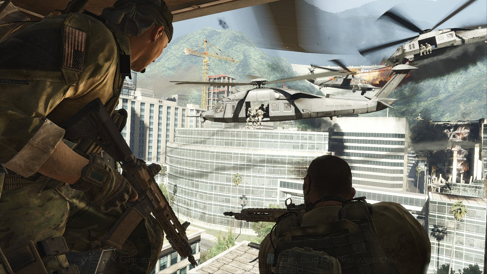
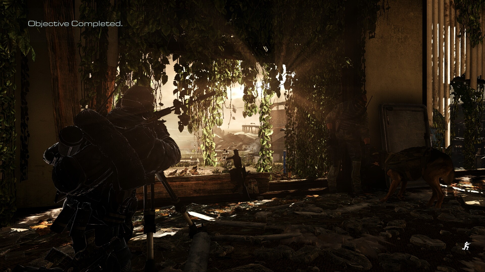
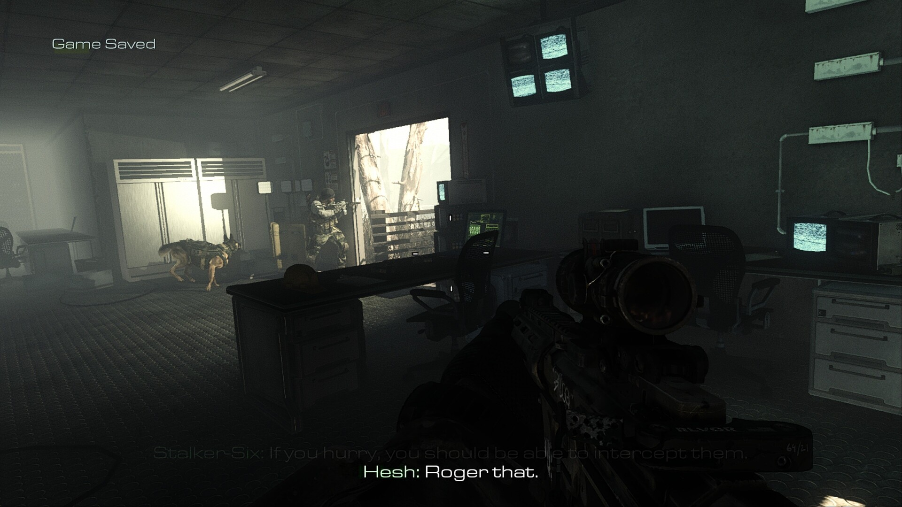
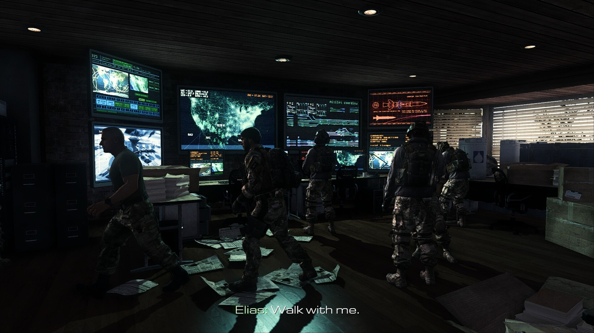

# ghosts-filmic-reshade

A **filmic-realism ReShade preset** and a **1080p60 tuning profile** for
**Call of Duty: Ghosts** (single-player, `iw6sp64_ship.exe`) running under
**Proton on the Steam Deck OLED**.

The goal: cut Ghosts' flat blue-grey wash and add subtle film-grade contrast,
natural color, and crisp detail — while keeping a **locked 60 fps at 1080p** on
Deck-class hardware.



<sub>All shots below are straight in-game captures with the preset active — no
external editing.</sub>

---

## What's in the preset

Four effects, in order, all cheap on frametime:

| Effect | Purpose |
|---|---|
| **FilmicPass** | Core grade: mild S-curve contrast, subtle bleach-bypass highlight rolloff, slight desaturation. The filmic base. |
| **Colourfulness** | Natural saturation lift that spares skin tones. |
| **AdaptiveSharpen** | Clean edge detail without ringing halos. |
| **FilmGrain2** | Barely-there grain (3%) for filmic texture. |

`LevelsPlus` ships enabled-in-file-but-off (available to toggle in the overlay).

`ReShade.ini` runs in **Performance Mode** (locks the preset, minimal runtime
overhead — ideal for a fixed look on a handheld).

---

## Screenshots

What the grade actually does, across the lighting cases that matter most:

<table>
  <tr>
    <td width="50%">
      
      <br><sub><b>Bright daylight.</b> Colourfulness lifts the greens and sky
      without pushing skin tones orange; highlights on the glass roll off
      instead of clipping.</sub>
    </td>
    <td width="50%">
      
      <br><sub><b>High dynamic range.</b> Blown-out window against deep shade —
      the S-curve holds detail at both ends, and AdaptiveSharpen picks out the
      leaf edges.</sub>
    </td>
  </tr>
  <tr>
    <td width="50%">
      
      <br><sub><b>Low light.</b> Where stock Ghosts looks most washed-out and
      blue — shadows sit down properly here without crushing to black.</sub>
    </td>
    <td width="50%">
      
      <br><sub><b>Mixed color temperature.</b> Cyan display glow against warm
      wood and lamplight, kept separated rather than muddied.</sub>
    </td>
  </tr>
</table>

> Compare for yourself in-game with **Scroll Lock** — it toggles every effect
> off and on for an instant before/after.

---

## Requirements

- Steam Deck (or any Linux + Proton box) with Call of Duty: Ghosts installed
- [ReShade](https://reshade.me/) **6.8.0+** (the installer is fetched by `install.sh`)
- The [crosire `reshade-shaders`](https://github.com/crosire/reshade-shaders)
  `legacy` + `slim` branches (also fetched by `install.sh`)

This repo intentionally does **not** bundle ReShade's `dxgi.dll` or the
third-party `.fx` files — they carry their own licenses. The installer pulls
them from source.

---

## Install (Steam Deck, Desktop Mode)

```bash
git clone https://github.com/samedayhurt/ghosts-filmic-reshade.git
cd ghosts-filmic-reshade
./install.sh
```

`install.sh` will:

1. Auto-detect the Ghosts install dir (or take it as `$1`).
2. Download ReShade 6.8.0, extract `ReShade64.dll` → `dxgi.dll` next to the game exe.
3. Fetch the shader library and copy in only the effects this preset uses.
4. Copy `ReShade.ini` + `Ghosts_Filmic.ini` into place.
5. Print the one-line **Proton DLL override** you still need to apply (see below).

### The Proton DLL override (required)

Proton must be told to load our `dxgi.dll`. The robust way (survives Steam
restarts, no launch-option needed) is a prefix registry entry.

Add this to `compatdata/209160/pfx/user.reg`, inside the
`[Software\\Wine\\DllOverrides]` section:

```
"dxgi"="native,builtin"
```

**Or** use a Steam launch option instead (Properties → Launch Options):

```
WINEDLLOVERRIDES="dxgi=n,b" %command%
```

> Note: on Steam Deck **Gaming Mode**, Steam is always running and rewrites its
> config on exit, so the **registry** method is more reliable than launch options.

---

## In-game controls

| Key | Action |
|---|---|
| **Home** | Open the ReShade overlay (drops out of Performance Mode so you can tweak) |
| **Scroll Lock** | Toggle all effects on/off (quick before/after) |

On the Deck, map these to back paddles or use an attached keyboard.

---

## 1080p60 graphics tuning

See [`config-tuning.md`](config-tuning.md) for the exact `players2/config.cfg`
changes. Summary:

| Setting | Value | Why |
|---|---|---|
| Textures (`r_picmip*`) | **0 (max)** | Near-free IQ win — Deck has the bandwidth |
| Anisotropic filter | **min 4 / max 16** | Cheap sharpening of oblique surfaces |
| Tessellation | **1_Near** (was 2_All) | Biggest perf lever; keeps close-up detail |
| VSync | **on** | Locks cleanly to a 60 Hz external |
| MSAA / SSAO | **2x / High** (kept) | Held with the tessellation drop |

**If a scene dips below 60**, dial in this order: SSAO High→Off → MSAA 2x→SMAA →
Tessellation Near→Off.

---

## Uninstall / revert

- Delete `dxgi.dll`, `ReShade.ini`, `Ghosts_Filmic.ini`, `reshade-shaders/`,
  `ReShade.log` from the game folder.
- Remove the `"dxgi"="native,builtin"` line from the prefix registry (or the
  launch option).
- Restore your `config.cfg` (the installer leaves a `.bak-*` backup).

---

## Credits & licenses

- **ReShade** © crosire — see <https://reshade.me/>. Not redistributed here.
- **Shaders** from [crosire/reshade-shaders](https://github.com/crosire/reshade-shaders)
  (`legacy` branch: FilmicPass, Colourfulness, AdaptiveSharpen, FilmGrain2,
  LevelsPlus). Each `.fx` carries its own header license.
- The preset, config profile, README, and installer in this repo are MIT
  (see [`LICENSE`](LICENSE)).
